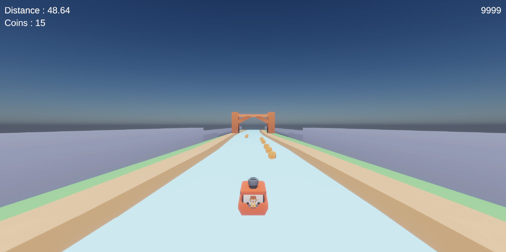
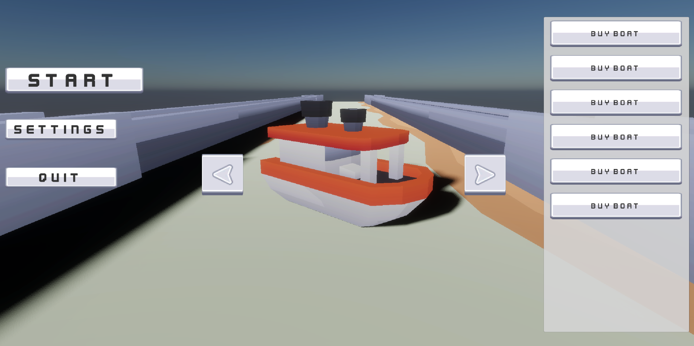

# AquaRush ⛵
Lets splash into this Game AquaRush!! Rushdown the waterway Avoiding objects, collecting coins, and reaching new distances further than ever before!
---
# Table of Contents
- [Overview](#Overview)
- [Core Classes](#Core-classes)
- [Features](#Features)
- [Structure/Architecture](#structure-architecture)
- [known issues/Bugs](#Known-Issues-Bugs)
- [Future Plans](#Future-Plans)
- [Credits](#Credits)
---
# overview
AquaRush is an endless runner game based on subway surfer, but the twist is its set in the ocean with boats with the player controlling a boat speeding through objects and collecting coins. The goal as most endless runners is to reach the farthest distance possible while collecting coins and avoiding all the hazards of the sea. 

---
# features
- ### Lane Based Movement System
    Similar 3 lane system as subway surfers
    - Uses Left/Right input to smoothly move between lanes
    - adjustable values for lane distance and transition time between lanes for added difficulty and flexablity
- ### Coin collection system
    Simple coin collection system 
    - keeps track of the number of coins the player collects
    - used to buy powerups or boats
- ### Challenge system
    challenges that renew every 24 hours
    - coin collection and distance challenges
    - get rewards for finishing the challenges 
  
---
# core classes
| Class | Description |
|-------|--------------|
| **SPlayerMovement** | Handles player movement, lane switching, and collision detection. |
| **SCoinManager** | Spawns and tracks coin objects and manages coin pickup logic. |
| **SBoatSelection** | Manages available boats, saving, and player customization. |
| **SPauseManager** | Controls the pause menu state and input handling. |
| **SUIManager** | Handles in-game UI updates such as coin count, distance, and menus. |

---
# structure-architecture
AquaRush
├── 🎮 Player

│     └── SPlayerMovement.cs

│

├── 💰 Gameplay Systems

│     ├── SCoinManager.cs

│     ├── SPowerUpManager.cs

│     └── SBoatSelection.cs

│

├── 🧠 Managers

│     ├── SGameManager.cs

│     ├── SPauseManager.cs

│     └── SSaveManager.cs

│

├── 🌊 Environment

│     ├── SObstacleManager.cs

│     └── SCoinSpawner.cs

│

├── 🧩 UI & Data

│   ├── SUIManager.cs

│   ├── SMainMenu.cs

└──  └── SShopMenu.cs

---
# known issues-Bugs
- Occasional coin spawns slightly offset from lanes.  
- Boat selection menu UI needs polishing on different resolutions.  
---
# future plans
For this project id like to push it out to itch.io and make an actual game of it. Id also like to push out versions for phone as well. Game wise id like to push for a complete shop system for the player to buy boats, collectables, and or powerups to use, I think this would be a good addition adding some flexiablity for the player in the game and visual appeal to the game. Id like to generally push for better graphics in the future i believe this would up the want to play the game in the players eyes.

---
# credits
**Design & Development:** Brandin Stanfield  
**Engine:** Unity  
**Programming Language:** C#  
**Inspiration:** Subway Surfers, Jetpack Joyride, Wave Rider

---
